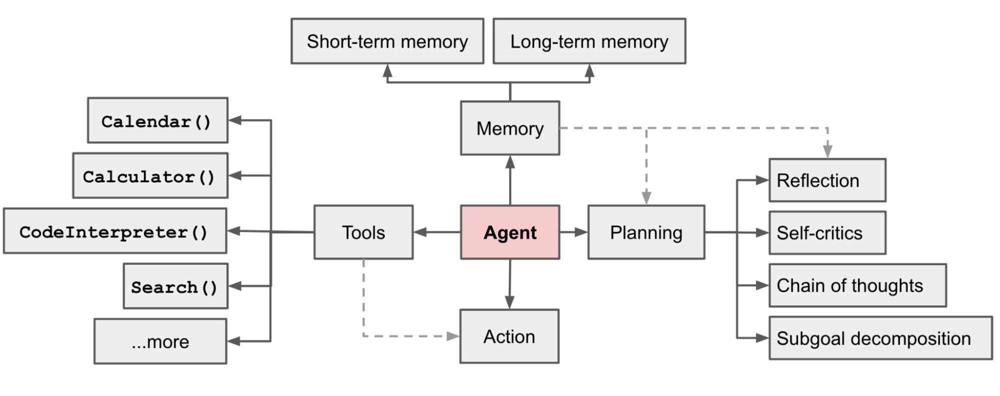

# ChatFlow Framework
Automate chatbot development with ease using this framework. Create a chatbot by defining nodes and connecting them using conditions. Develop a chatbot in minutes with this intuitive framework.

## Overview
This framework simplifies chatbot development by allowing users to create nodes and connect them to form workflows. It supports various output formats and retrieval nodes, with the ability to define custom nodes. (#TODO)

## Comparison with Agents
LLM agents are systems that leverage the capabilities of large language models to perform various tasks autonomously or semi-autonomously. These agents integrate several modules to process inputs, generate responses, interact with users, and sometimes even learn from their interactions. You can see an [illustration](https://lilianweng.github.io/posts/2023-06-23-agent/) of different components involved in an LLM agent in the image below. This architecture includes memory management, planning, tool integration, and action execution, all orchestrated by the central agent component.


### Advantages of ChatbotFlow Framework:
ChatbotFlow framework can be described as a kind of restricted agent because the planning component found in typical agents is replaced with a predefined flowchart that contains rules for routing. In this framework, chatbot decisions are not entirely made by LLMs. At each state, the user can define a node for decision-making and plan subsequent nodes based on the output of the current node.   

1.  **Efficiency in Token Usage**: By using hard-coded reasoning and rule-based decision-making, ChatbotFlow significantly reduces the number of tokens required for each interaction. This efficient use of tokens can result in lower operational costs and faster processing times.
2.  **Speed**: The rule-based decision-making process in ChatbotFlow ensures faster response times compared to LLM agents, which may require complex reasoning and planning. The simplicity of rule-based logic avoids the computational overhead associated with the advanced planning mechanisms of LLM agents.
3.  **Reliability in Production**: ChatbotFlow provides more predictable and reliable behavior, crucial for production environments. LLM agents, while powerful, can sometimes be unpredictable and may get stuck in infinite loops of planning and decision-making. The deterministic nature of rule-based chatbots ensures consistent performance and reliability.
4.  **Controlled Reasoning**: By hard-coding the reasoning part, you have full control over the decision-making process. This allows for precise management of interactions and ensures that the chatbot behaves exactly as intended, without unexpected deviations.
(#TODO need rewrite and review)
## Installation
<!-- todo -->
<not ready for installation>
To install the framework, simply run:(#TODO)
<!-- Make a copy of '.env.example' file and name it '.env'. Change the value of the variables.<br> -->
<!-- Check 'test-bot.ipynb' in tests directory to get familiar with the library usage. -->

## Modules
*   Node: nodes are execution units of workflows. They receive inputs, process them, and return results in custom format. odes can be executed independently without being a part of a flow. There are multiple Node types with different internal logics:
    *   String Output Node: if output_variables parameter in node factory be a string, a String Output Node will be generated
        ```
        from bot.models.node import NodeFactory
        node = NodeFactory.create_node(prompt_template=advertisement_prompt, 
                                   input_variables=['user_message'],
                                   output_variables='response',
                                   is_output=True, model_name=model_name)
        ```
    *   Json Output Node: to create a json output node, a dictionary containing the variable names and types must be passed as output_variables to the NodeFactory.
        ```
        node = NodeFactory.create_node(prompt_template=decision_prompt, 
                                       input_variables=['user_message'], 
                                       output_variables={'technical':bool, 
                                                       'sales':bool, 
                                                       'advertisement':bool,
                                                       'chitchat': bool},
                                       return_inputs=True, model_name=model_name)
        ```
    *   Retrieval Node: these nodes retrieve data from pdf, csv, and database
        ```
        node = NodeFactory.create_retrieval(prompt_template= prompt_template, 
                                            input_variables=['query'], 
                                            output_variables='response',
                                            persist_directory=persist_directory,
                                            collection_name='test-retrieval',
                                            docs_dir=docs_dir,
                                            context_var='context',
                                            query_var= 'query',
                                            k_result= 3,
                                            return_inputs= True,
                                            is_output= True, 
                                            model_name=model_name)
        ```
    <!-- *   Custom Node -->
*   Condition: conditions are rules that facilitate routing in flow of the chatbot
    ```
    from bot.models.condition import Condition, Operator
    # if the value of 'sales' variable in the start_node outputs be equal to 'True', 
    # sales_node will be the next node in the flow
    start_node.set_next_item({sales_node: Condition('sales', True, Operator.EQUALS),
                          adv_node: Condition('advertisement', True, Operator.EQUALS),
                          tech_node: Condition('technical', True, Operator.EQUALS),
                          chitchat_node: Condition('chitchat', True, Operator.EQUALS)})
    ```
*   State: each state has a name, definition and an associated node. Based on the definition of each state, flow decides a state to resume execution. 
    ```
    state = State(name='chitchat', 
                  definition='in this state counselor will start the conversation with a chitchat and greets the client. counselor can stay as many steps as needed in this state. next state is rapport building.', 
                  associated_node=chitchat_node)
    ```
*   Flow: this module is the final workflow of the chatbot and is responsible for running all blocks together and pass each modules's output to the next one. Setting ```debug=True``` will print the execution log of each node. 
    ```
    from bot.models.flow import Flow
    
    flow = Flow(start_node=start_node, debug=True)
    ```
    ```
    flow = Flow(states=states, start_state=start_state, model_name=model_name, debug=True)
    ```

## Customization

## Examples
These are example usages of the framework:
*   [Simple Customer Service Bot](examples/1-MultifacetedCostumerServiceBot/README.md)
*   [ChatBot with Retrieval Node](examples/2-ScientificPaperQABot/README.md)
*   [ChatBot with SQL Retrieval Node](examples/3-CostumerRecord&PolicyBot/README.md)
*   [English Learning Chatbot](examples/5-EnglishTeacherBot/README.md)
*   [Multi-State Restaurant Order Bot](examples/6-McDonaldServer&NutritionistBot/)

## Contributing

## Version History
current version: v1.0-20240510 (initial version)

