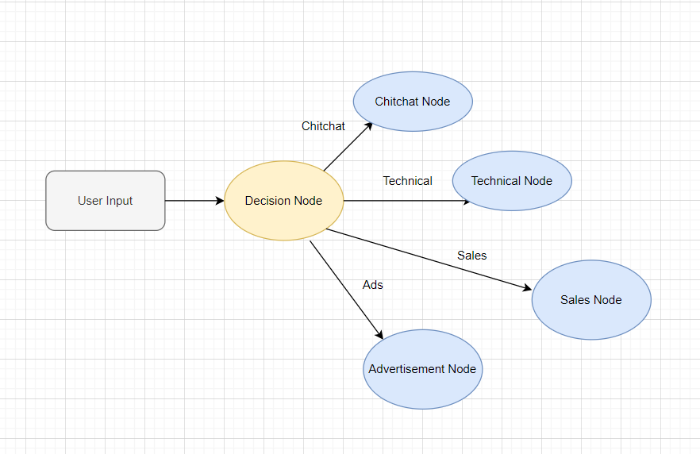

# Example 1
# Multifaceted Costumer Service Bot:  ChatFlow Framework for a Simple Chatbot

This guide will walk you through the process of using the ChatFlow framework to create a simple chatbot.

## Scenario

The ChatFlow framework allows you to build a chatbot that can handle different categories of user inquiries. In this guide, we’ll create a chatbot for a hypothetical company, Pinnacle Auto Group, with separate handlers for ‘sales’, ‘advertisement’, ‘technical’, and ‘chitchat’ inquiries.


## Workflow Diagram


## Setup

Before you start, make sure to import the necessary modules and load the environment variables from the .env file. For this example, the environmental variable is the OpenAI API key.

```python
from dotenv import load_dotenv
from bot.models.condition import Condition, Operator
from bot.models.node import NodeFactory
from bot.models.flow import Flow
from assets.prompts import *


load_dotenv()
```

## Building the Chatbot
The first step is to create a decision node that will determine which handler should respond to the user’s message.
```python

start_node = NodeFactory.create_node(prompt_template=decision_prompt,
                                     input_variables=['user_message'],
                                     output_variables={'technical': bool,
                                                       'sales': bool,
                                                       'advertisement': bool,
                                                       'chitchat': bool},
                                     return_inputs=True)
```

For each category, create a handler with its specific prompt.

```python
adv_node = NodeFactory.create_node(prompt_template=advertisement_prompt,
                                   input_variables=['user_message'],
                                   output_variables='response',
                                   is_output=True)

tech_node = NodeFactory.create_node(prompt_template=technical_prompt,
                                    input_variables=['user_message'],
                                    output_variables='response',)

sales_node = NodeFactory.create_node(prompt_template=sales_prompt,
                                     input_variables=['user_message'],
                                     output_variables='response',
                                     is_output=True)

chitchat_node = NodeFactory.create_node(prompt_template=chitchat_prompt,
                                        input_variables=['user_message'],
                                        output_variables='response',
                                        is_output=True)
```

Note that all the prompts and information about the company are given in the `prompt.py` file in the assets directory.

After creating the handlers, define the workflow of the chatbot. This will determine which handler responds based on the category of the user’s message.

```python
start_node.set_next_item({sales_node: Condition('sales', True, Operator.EQUALS),
                      adv_node: Condition('advertisement', True, Operator.EQUALS),
                      tech_node: Condition('technical', True, Operator.EQUALS),
                      chitchat_node: Condition('chitchat', True, Operator.EQUALS)})
```
Finally, create the chatbot object, initialize it, and start handling messages.
```python
customer_service_flow = Flow(start_node=start_node)
customer_service_flow.initialize()

inp = {'user_message': "what is the company's name"}
print(customer_service_flow.run(inp))
```


