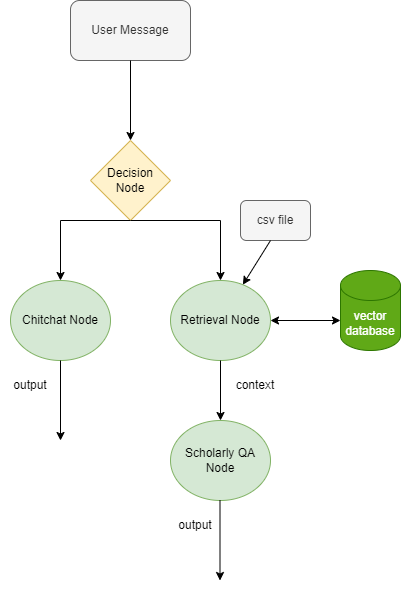

# Example 2
# Scientific Paper QA Bot: ChatFlow Framework for a Retrieval Chatbot

This guide will walk you through the process of using the ChatFlow framework to create a chatbot that can answer questions about a specific PDF file.

## Scenario

The chatbot operates in two phases: a general chitchat phase and a PDF retrieval phase. The user provides a PDF file and asks questions about its content. The chatbot first engages in general chitchat, then accesses the PDF file to respond to the user’s inquiries.

## Workflow Diagram


## Setup

Before you start, import the necessary modules and load the environment variables from the .env file.

```python
from dotenv import load_dotenv
from bot.models.condition import Condition, Operator
from bot.models.node import NodeFactory
from bot.models.flow import Flow
from assets.prompts import *


load_dotenv()
```

## Building the Chatbot

The first step is to create a decision node that will determine whether the user’s input is general chitchat or related to the PDF.

```python
start_node = NodeFactory.create_node(prompt_template=decision_prompt,
                                     input_variables=['user_message'],
                                     output_variables={'Scholarly': bool,
                                                       'chitchat': bool},
                                     return_inputs=True)
```

Create a node for the chitchat phase.

```python
chitchat_node = NodeFactory.create_node(model_name=model_name, prompt_template=chitchat_prompt,
                                        input_variables=['user_message'],
                                        output_variables='response',
                                        is_output=True)
```

For the retrieval node, specify the path of the PDF file and the location where you intend to store the embedding database of the PDF.

```python
persist_directory = os.path.join(os.getcwd(), "data")
docs_dir = os.path.join(os.getcwd(), "Candidate Set Sampling for Evaluating Top-N Recommendation.pdf")
```

Following this, create a retrieval node. This node generates a vector database that contains the embeddings of the PDF. 
It’s important to note that Since the user input is named `user_message` in the start_node, the input variable for the subsequent nodes is also named `user_message`. You can add more variables to the node if necessary.
Note that this node only returns the retrieved content to the variable dictionary. To respond to the inquiry, you must create another string output node.
Also, it’s important to note that the retrieved data, which is stored as context, is included in the input variables of the string output node.

```python
retrieval_node = NodeFactory.create_retrieval(input_variables=['user_message'],
                                              output_variables='context',
                                              persist_directory=persist_directory,
                                              collection_name='test-retrieval',
                                              docs_dir=docs_dir,
                                              k_result=3,)
node_retrieval_qa = NodeFactory.create_node(prompt_template=retieval_prompt_template,
                                            input_variables=['user_message', 'context'],
                                            output_variables='response',
                                            is_output=True)
```

Define the workflow of the chatbot. After deciding the category of the user’s message, pass the message to the corresponding sub-chatbot. Also, chain up the retrieval node and its corresponding string output node.

```python
start_node.set_next_item({retrieval_node: Condition('Scholarly', True, Operator.EQUALS),
                          chitchat_node: Condition('chitchat', True, Operator.EQUALS)})
retrieval_node.set_next_item(node_retrieval_qa)
```

Finally, create the chatbot object, initialize it, and start handling messages.

```python
flow_bot = Flow(start_node=start_node)
flow_bot.initialize()

inp = {'user_message': "In less than 40 words, give a summary about the abstract of the paper?"}
res = flow_bot.run(inp)
print(inp)
print(res)
print(20*"@")

inp = {'user_message': "Hi, how is it going?"}
res = flow_bot.run(inp)
print(inp)
print(res)
print(20*"@")
```

