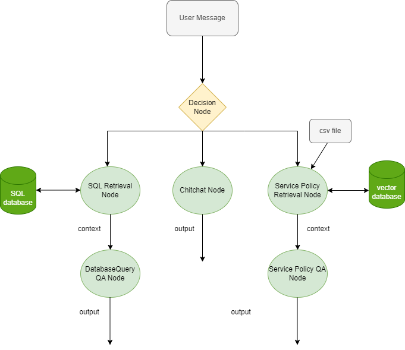

# Example 3
# Costumer Record & Policy Bot: Building a Customer Service Chatbot with ChatFlow Framework

This guide will walk you through the process of using the ChatFlow framework to create a customer service chatbot. This chatbot can access a PDF file containing customer service policies and a SQL database containing customer information.

## Scenario

The chatbot operates in three phases: a general chitchat phase, a customer service policy retrieval phase, and a customer database query phase. The user provides a PDF file and a customer database, and the chatbot responds to user inquiries in these three phases.

## Workflow Diagram


## Setup

Before you start, import the necessary modules and load the environment variables from the .env file.

```python
from dotenv import load_dotenv
from bot.models.condition import Condition, Operator
from bot.models.node import NodeFactory
from bot.models.flow import Flow
from assets.prompts import *


load_dotenv()
```

## Building the Chatbot

The first step is to create a decision node that will categorize the user’s message.

```python

start_node = NodeFactory.create_node(model_name=model_name, prompt_template=decision_prompt,
                                     input_variables=['user_message'],
                                     output_variables={'ServicePolicy': bool,
                                                       'DatabaseQuery': bool,
                                                       'chitchat': bool},
                                     return_inputs=True)

```

Create the chitchat node, the policy retrieval node, and the SQL retriever node. Note that for these nodes, the input variable is set to user_message. Also, for the retrieval nodes, the output variables must be compatible with the input messages for the corresponding string output nodes.

```python
node_chitchat = NodeFactory.create_node(prompt_template=prompt_chitchat,
                                        input_variables=['user_message'],
                                        output_variables='response',
                                        is_output=True)


persist_directory = os.path.join(os.getcwd(), "policyData")
docs_dir = os.path.join(os.getcwd(), "accessible-customer-service-policy.pdf")
node_retrieval = NodeFactory.create_retrieval(input_variables=['user_message'],
                                              output_variables='context',
                                              persist_directory=persist_directory,
                                              collection_name='test-retrieval',
                                              docs_dir=docs_dir,
                                              k_result=3)

node_policy_qa = NodeFactory.create_node(prompt_template=prompt_retrieval,
                                        input_variables=['user_message', 'context'],
                                        output_variables='response',
                                        is_output=True)

db_path = "testDB.db"
node_sql_retrieval = NodeFactory.create_sql_node(input_variables=['user_message'],
                                                 output_variables='result',
                                                 db_path=db_path,)

node_db_qa = NodeFactory.create_node(prompt_template=prompt_db_qa,
                                     input_variables=['user_message', 'result'],
                                     output_variables='response',
                                     is_output=True)
```

Define the workflow chain of the chatbot by connecting the appropriate conditions to their corresponding nodes. Additionally, connect the retriever nodes to their string output node that was created.

```python
node_start.set_next_item({node_retrieval: Condition('ServicePolicy', True, Operator.EQUALS),
                          node_sql_retrieval: Condition('DatabaseQuery', True, Operator.EQUALS),
                          node_chitchat: Condition('chitchat', True, Operator.EQUALS)})
node_sql_retrieval.set_next_item(node_db_qa)
node_retrieval.set_next_item(node_policy_qa)
```

After setting up everything, create the main chatbot object and initialize it. You can now pass messages to it.

```python
flow_bot = Flow(start_node=node_start)
flow_bot.initialize()

inp = {'user_message': "Hi. My name is Henry."}
res = flow_bot.run(inp)
print(inp)
print(res)
print(20 * "@")

inp = {'user_message': "Could you please provide an overview of your company's policies regarding communication with customers?"}
res = flow_bot.run(inp)
print(inp)
print(res)
print(20 * "@")

inp = {'user_message': "Are ages of the costumers provided in the database?"}
res = flow_bot.run(inp)
print(inp)
print(res)
print(20 * "@")

inp = {'user_message': "Give me the names of all the customers."}
res = flow_bot.run(inp)
print(inp)
print(res)
print(20 * "@")


inp = {'user_message': "How many customer orders have you received so far?"}
res = flow_bot.run(inp)
print(inp)
print(res)
print(20 * "@")
```
