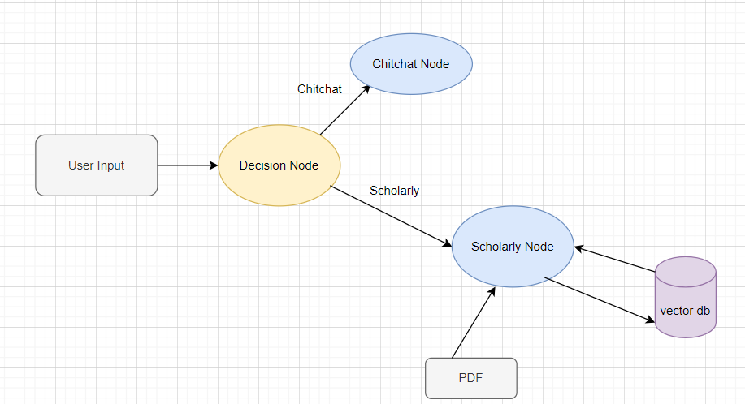

# Example 2: ChatFlow Framework for a Retrieval Chatbot

In this example, we utilize the ChatFlow framework to develop a chatbot capable of interacting with users and answering their questions about a specific PDF file.

## Scenario

The user provides a PDF file and poses questions about its content. Our chatbot operates in two distinct phases. The first phase is dedicated to general chitchat, while the second phase accesses the PDF file to respond to the user’s inquiries.

## How to Use

Given that our chatbot operates in two phases, we need to add a decision node to determine whether the user’s input is general chitchat or related to our PDF.

```python
decision_prompt = """Categorize the user message into one of the following categories:
        1. Scholarly
        4. chitchat

        << USER MESSAGE >>
        {user_message}

        << RULES >>
        1- Put your answer in json format.
        1- The output is a json object that the value of the input message category is TRUE and other output keys are FALSE
        """
start_node = NodeFactory.create_node(model_name=model_name, prompt_template=decision_prompt,
                                     input_variables=['user_message'],
                                     output_variables={'Scholarly': bool,
                                                       'chitchat': bool},
                                     return_inputs=True)
```

We also need to create the node for the chitchat phase
```python
chitchat_prompt = """You are a warm and friendly, yet not so talkative Science Communicator. 
        chat with the user and ask them if they have questions related to the paper they have uploaded.

        << USER MESSAGE >>
        {user_message}
        BOT RESPONSE:"""
chitchat_node = NodeFactory.create_node(model_name=model_name, prompt_template=chitchat_prompt,
                                        input_variables=['user_message'],
                                        output_variables='response',
                                        is_output=True)
```
For retrieval node, we must specify the path of the PDF file and the location where we intend to store the embedding database of the PDF.

```python
persist_directory = os.path.join(os.getcwd(), "data")
docs_dir = os.path.join(os.getcwd(), "Candidate Set Sampling for Evaluating Top-N Recommendation.pdf")
```

Following this, we create a retrieval node. This node generates a vector database that contains the embeddings of the PDF. It’s important to note that Since the user input is named `user_message` in the start_node, the prompt input and query variable for the subsequent nodes should also be named `user_message` for consistency.

```python
retieval_prompt_template = """Answer the following question based on the provided context. Avoid using your own knowledge and adhere to the provided data.
    
    << query >> 
    {user_message}
    
    << context >>
    {context}
    """
persist_directory = os.path.join(os.getcwd(), "data")
    docs_dir = os.path.join(os.getcwd(), "Candidate Set Sampling for Evaluating Top-N Recommendation.pdf")
    retrieval_node = NodeFactory.create_retrieval(model_name=model_name,
                                        prompt_template=retieval_prompt_template,
                                        input_variables=['user_message'],
                                        output_variables='response',
                                        persist_directory=persist_directory,
                                        collection_name='test-retrieval',
                                        docs_dir=docs_dir,
                                        context_var='context',
                                        query_var='user_message',
                                        k_result=4,
                                        return_inputs=True,
                                        is_output=True)
```


Now we have to define the chain of workflow of the chatbot. We are going to define that after deciding which category the user's message was, pass the message to the corresponding sub-chatbot.

```python
start_node.set_next_item({retrieval_node: Condition('Scholarly', True, Operator.EQUALS),
                              chitchat_node: Condition('chitchat', True, Operator.EQUALS)})

```
After setting up everything, we are going to create the main chatbot's object, and we can pass messages to it.
```python
flow_bot = Flow(start_node=start_node)


inp = {'user_message': "In less than 40 words, give a summary about the abstract of the paper?"}
res = flow_bot.run(inp)
print(inp)
print(res)
print(20*"@")

inp = {'user_message': "Hi, how is it going?"}
res = flow_bot.run(inp)
print(inp)
print(res)
print(20*"@")
```


## Workflow Diagram

