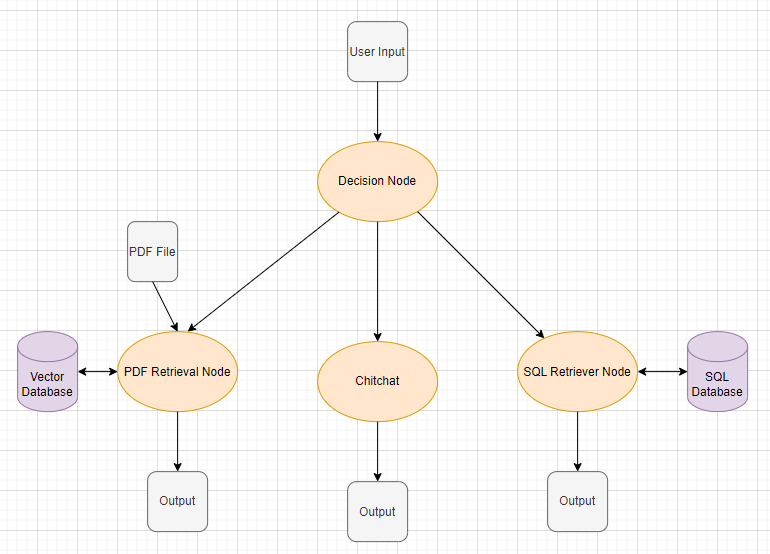

# Example 3: Building a Customer Service Chatbot with ChatFlow Framework

This example demonstrates how to use the ChatFlow framework to create a customer service chatbot. This chatbot has access to a PDF file containing customer service policies and a SQL database containing customer information.

## Scenario

The user provides a PDF file and a customer database. The chatbot operates in three different phases. The first phase is for general chitchat, the second phase handles queries about customer service policies, and the final phase accesses the provided SQL database to respond to user inquiries.

## How to Use

The first step is to create a decision node that will categorize the user’s input.

```python

decision_prompt = """Categorize the user message into one of the following categories:
        1. ServicePolicy
        2- DatabaseQuery
        3. chitchat

        << USER MESSAGE >>
        {user_message}

        << RULES >>
        1- Put your answer in json format.
        1- The output is a json object that the value of the input message category is TRUE and other output keys are FALSE
        """
start_node = NodeFactory.create_node(model_name=model_name, prompt_template=decision_prompt,
                                     input_variables=['user_message'],
                                     output_variables={'ServicePolicy': bool,
                                                       'DatabaseQuery': bool,
                                                       'chitchat': bool},
                                     return_inputs=True)

```

Next, create the retrieval node, chitchat node, and the SQL retriever node. Please note that for these nodes, the user query and input variable should be set to `user_message` since, initially, we had set the user message in `node_start` to be `user_message`.
The SQL retriever node only returns the records or the result of aggregate functions (such as average, sum, count, etc.). To provide a proper response to the user, you need to add another string output node to format and present the retrieved information.

```python
chitchat_prompt = """..."""
chitchat_node = NodeFactory.create_node(model_name=model_name, prompt_template=chitchat_prompt,
                                        input_variables=['user_message'],
                                        output_variables='response',
                                        is_output=True)

retieval_prompt_template = """Answer the following question based on the provided context. Avoid using your own knowledge and adhere to the provided data.

<< query >> 
{user_message}

<< context >>
{context}
"""
persist_directory = os.path.join(os.getcwd(), "policyData")
docs_dir = os.path.join(os.getcwd(), "accessible-customer-service-policy.pdf")
retrieval_node = NodeFactory.create_retrieval(model_name=model_name,
                                              prompt_template=retieval_prompt_template,
                                              input_variables=['user_message'],
                                              output_variables='response',
                                              persist_directory=persist_directory,
                                              collection_name='test-retrieval',
                                              docs_dir=docs_dir,
                                              context_var='context',
                                              query_var='user_message',
                                              k_result=4,
                                              return_inputs=True,
                                              is_output=True)

db_path = "testDB.db"
node_sql_retrieval = NodeFactory.create_sql_node(model_name=model_name,
                                              input_variables=['user_message'],
                                              output_variables='response',
                                              db_path=db_path,
                                              result='result',
                                              return_inputs=True)
prompt_sql_qa = """Answer the following question based on the result, retrieved from the database. Avoid using your own knowledge and adhere to the provided data.

<< query >> 
{user_message}

<< result >>
{result}
"""

node_sql_qa = NodeFactory.create_node(model_name=model_name, prompt_template=prompt_sql_qa,
                                        input_variables=['user_message', 'result'],
                                        output_variables='response',
                                        is_output=True)
```

Now, define the workflow chain of the chatbot by connecting the appropriate conditions to their corresponding nodes. Additionally, connect the SQL retriever node to the string output node that we created earlier.

```python
start_node.set_next_item({retrieval_node: Condition('ServicePolicy', True, Operator.EQUALS),
                          sql_node: Condition('DatabaseQuery', True, Operator.EQUALS),
                          chitchat_node: Condition('chitchat', True, Operator.EQUALS)})

```

After setting up everything, create the main chatbot object. You can now pass messages to it.

```python
flow_bot = Flow(start_node=start_node)

inp = {'user_message': "Hi. My name is Henry."}
res = flow_bot.run(inp)
print(inp)
print(res)
print(20 * "@")

inp = {'user_message': "Could you please provide an overview of your company's policies regarding communication with customers?"}
res = retrieval_node.run(inp)
print(inp)
print(res)
print(20 * "@")

inp = {'user_message': "How many customer orders have you received so far?"}
res = flow_bot.run(inp)
print(inp)
print(res)
print(20 * "@")
```

## Workflow Diagram

