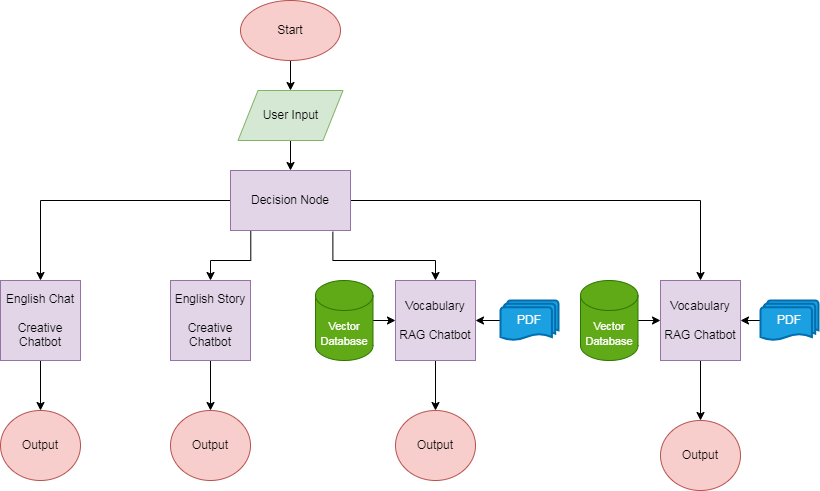

# Example 5: English Learning Chatbot

The **English Learning Chatbot** is an interactive language learning tool designed to help users improve their English skills. Whether you’re a beginner or an advanced learner, this chatbot provides a range of features to enhance your language proficiency.

## Features

1- **English Story Generation**:
The chatbot can generate short stories in English. Users can request a story, and the chatbot will respond with an original narrative. 

2- **Grammar Lessons**:
Learn English grammar rules and concepts through interactive lessons. The chatbot provides explanations, examples, and quizzes to reinforce understanding.

3- **Vocabulary Building**:
Discover new words and expand your vocabulary. The chatbot offers word definitions, synonyms, and usage examples.

4- **Conversational Practice**:
Engage in English conversations with the chatbot. Practice writing in natural language.

## Workflow Diagram

