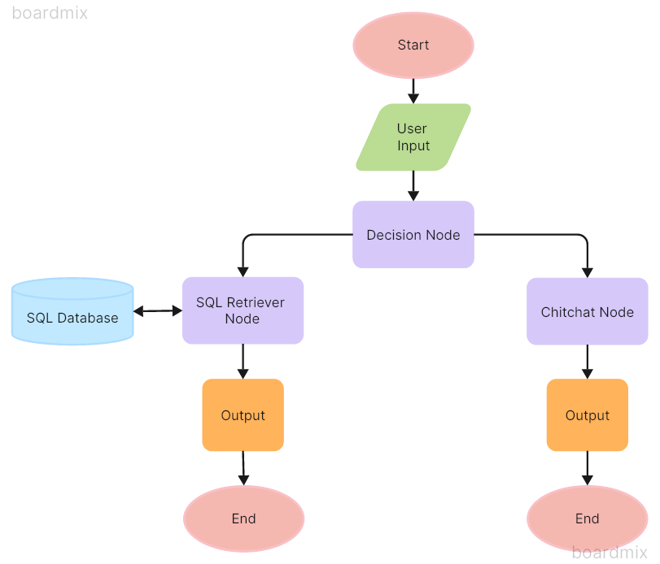

# Example 6: Building a Chef Chatbot with ChatFlow Framework

This example demonstrates how to use the ChatFlow framework to create a chef chatbot. This chatbot has access to a SQL database containing cooking information.

## Scenario

The chatbot operates in two different phases. The first phase is for general chitchat, the second phase accesses the provided SQL database to respond to user inquiries.

## How to Use

## Workflow Diagram

